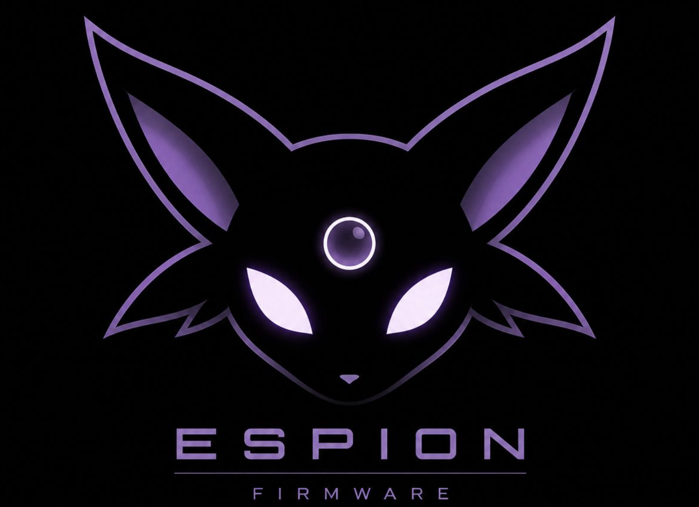

<p align="center">
  
</p>

<h1 align="center">ESPION</h1>

<p align="center">
  <strong>Engineered by Espada</strong>
</p>

<p align="center">
  Next-generation ESP32-S3 firmware inspired by modern embedded platforms.
</p>

<div align="center">

# 🟣 ESPION 🟣

### **Embedded Security Platform**

*A modern embedded operating environment for the ESP32-S3*

<p>
  <strong>Engineered by Espada</strong><br>
  <a href="https://github.com/Xeyzen7959">@Xeyzen7959</a>
</p>


---

*A premium modular firmware designed for embedded security research, wireless analysis, and hardware experimentation.*

</div>

---

# ✨ Overview

ESPION is an original firmware platform built specifically for the **ESP32-S3**, combining a modern graphical interface with a modular architecture designed for future expansion.

Rather than being a collection of independent utilities, ESPION is designed as a complete embedded operating environment that emphasizes performance, maintainability, and user experience.

The project is intended for educational, research, and prototyping purposes.

---

# 🚀 Features

## Core Operating System

* Modern animated boot sequence
* Responsive graphical user interface
* Smooth menu navigation
* Theme management
* Status bar
* Battery monitoring
* SD card support
* Modular application framework

---

## Wireless Analysis

* Wi-Fi network scanning
* Bluetooth Low Energy scanning
* Signal strength monitoring
* Device information viewer

---

## Storage

* microSD filesystem
* Configuration management
* Persistent settings
* Scan history
* Log management
* Data export

---

## Planned Expansion

* RFID Support (MFRC522)
* CC1101
* NRF24L01
* GPS Module
* Plugin System
* Additional wireless modules

---

# 🖥 Hardware

| Component  | Model                |
| ---------- | -------------------- |
| MCU        | ESP32-S3 DevKitC-1   |
| Display    | 2.8" ILI9341 SPI TFT |
| Resolution | 320 × 240            |
| Graphics   | LovyanGFX            |
| Navigation | 5-Way Switch         |
| Storage    | microSD              |
| Power      | LiPo Battery         |
| Charging   | TP4056 USB-C         |

---

# 🛠 Software Stack

* C++17
* Arduino Framework
* PlatformIO
* LovyanGFX
* Git
* GitHub

---

# 📂 Project Structure

```text
ESPION/
│
├── assets/
│   ├── fonts/
│   ├── icons/
│   └── logo/
│
├── docs/
│
├── include/
│
├── lib/
│
├── src/
│
├── platformio.ini
├── README.md
└── LICENSE
```

---

# 🗺 Roadmap

## v0.1

* Animated boot sequence
* Graphics engine
* Menu system
* Input manager
* About page

---

## v0.2

* Settings
* Logging
* SD card support
* Configuration system

---

## v0.3

* Wi-Fi Analyzer
* BLE Scanner
* Data Export

---

## v1.0

* Plugin architecture
* Performance optimization
* Stable release

---

# 🎨 Design Philosophy

ESPION is built around five principles:

* **Modular Architecture**
* **Performance First**
* **Professional UI**
* **Scalable Design**
* **Maintainable Code**

Every component is designed to be reusable and easily extendable.

---

# 📸 Screenshots

> *Coming Soon*

* Boot Animation
* Main Menu
* Wi-Fi Analyzer
* Bluetooth Scanner
* Settings
* About Page

---

# 📦 Building

Clone the repository:

```bash
git clone https://github.com/Xeyzen7959/ESPION.git
cd ESPION
```

Open the project using **Visual Studio Code** with **PlatformIO** installed.

Build:

```bash
pio run
```

Upload:

```bash
pio run --target upload
```

Serial Monitor:

```bash
pio device monitor
```

---

# 📖 Documentation

Project documentation is available inside the `/docs` directory.

Documentation includes:

* Architecture
* Hardware
* Pin Mapping
* Development Roadmap
* Coding Standards

---

# 🤝 Contributing

Contributions, suggestions, and bug reports are welcome.

If you would like to improve ESPION, feel free to open an issue or submit a pull request.

---

# 📜 License

This project is licensed under the **MIT License**.

See the **LICENSE** file for more information.

---

<div align="center">

## ESPION

**Embedded Security Platform**

**Engineered by Espada**

**GitHub:** https://github.com/Xeyzen7959

</div>
